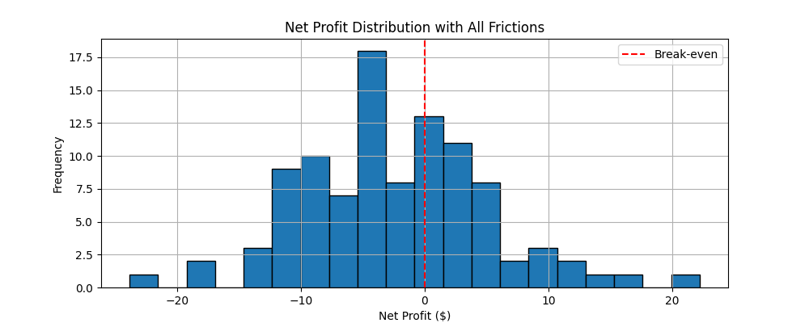

# Arbitrage Reality Check

This project simulates arbitrage opportunities across two markets to test whether they remain profitable once real-world trading frictions are introduced. The goal is to explore how slippage, fees, latency, and volatility affect net profitability — and when theoretical profit vanishes in practice.

---

## What It Shows

Using simple Python simulations and visualisations, this model demonstrates:

- How arbitrage works in an ideal, frictionless setting
- How slippage from trade size erodes profit
- How transaction fees shift breakeven points
- How price drift during latency introduces execution risk
- How real-world frictions turn deterministic profits into probabilistic outcomes

---

## Scenarios Modelled

### Scenario 1: Frictionless Arbitrage  
> Buy low, sell high with no trading frictions.  
> Arbitrage is guaranteed and consistently profitable.

### Scenario 2: Slippage  
> Large trade sizes impact price.  
> Profit declines or vanishes due to execution impact.

### Scenario 3: Fees  
> Flat transaction costs are introduced.  
> Breakeven spread increases, small profits disappear.

### Scenario 4: Latency & Price Drift  
> Delayed execution introduces price uncertainty.  
> Some trades become unprofitable due to slippage in timing.

### Scenario 5: Combined Effects  
> All frictions applied in a Monte Carlo simulation.  
> Net profits follow a distribution — arbitrage becomes a probabilistic strategy.

---

## Technologies Used

- Python 3
- Jupyter Notebook
- NumPy
- Matplotlib

---

## How to Run

1. Clone the repo or download the notebook:
    ```bash
    git clone https://github.com/yourusername/arbitrage-reality-check
    cd arbitrage-reality-check
    ```

2. Create and activate a virtual environment:
    ```bash
    python3 -m venv venv
    source venv/bin/activate
    ```

3. Install dependencies:
    ```bash
    pip install -r requirements.txt
    ```

4. Launch Jupyter:
    ```bash
    jupyter notebook
    ```

5. Open `arbitrage_reality_check.ipynb` and run all cells.

---

## Example Outputs

### Scenario 5: Combined Frictions – Monte Carlo Run

**Net Profit Distribution:**


---

## Key Learnings

- Slippage and fees introduce hidden costs that often wipe out thin spreads.
- Latency and volatility create execution risk that makes profitability uncertain.
- Arbitrage only works reliably when the spread is large enough to survive real-world trading frictions.
- Simulating market conditions helps understand when a strategy fails before deploying capital.

---

## Future Extensions

- Add gas costs or on-chain transaction delays (DeFi-specific)
- Model arbitrage between AMMs with varying fees and liquidity
- Simulate competing bots or front-running risk (MEV)
- Introduce time-varying spread or volume constraints

---
